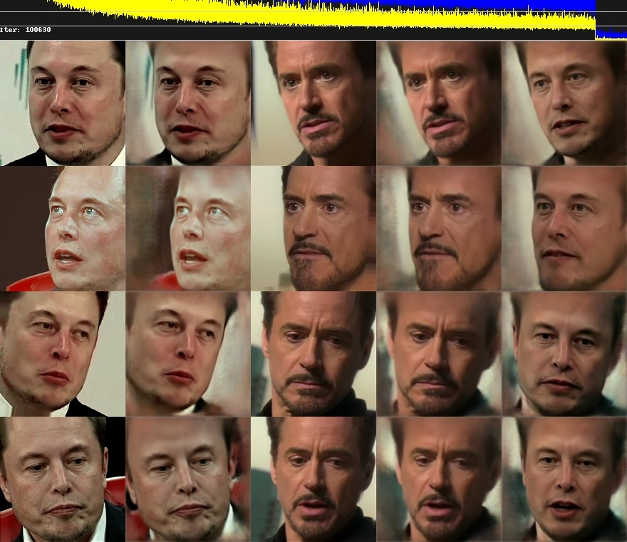
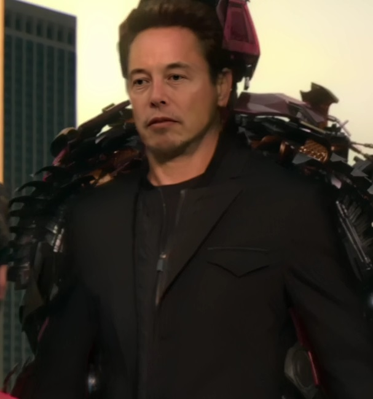

This is a fork of [https://github.com/lbfs/DeepFaceLab_Linux](bfs/DeepFaceLab_Linux).

This fork uses a docker container to install DeeFaceLab_Linux instead of Anaconda3. The changes made regard the installation process only. No changes have been made to DeepFaceLab itself.

# Installation

**Notes**: 

Currently, there's only one option available to install DeepFaceLab Linux.
That is, you have cloned this repository before you start the installation. The provided ```docker/Dockerfile``` does not download this repository at the moment.

The routine does not install cuda or opencl drivers at the moment. You can uncommebt the parts required in the
```docker/Dockerfile```


## 1) Install and start/enable Docker

**Note:** The user running the docker container must be member of the group "docker". This example is for
Archlinux. Docker is available in repositories of many other Linux distros.

```bash
# pacman -S docker
# usermod -a -G docker ${USER}
# systemctl start docker
```

## 2) Clone the repository

```bash
$ git clone https://github.com/aspera-non-spernit/DeepFaceLab_Linux
```

## 3) Change directory and make the build script executable

```bash
$ cd DeepFaceLab_Linux
$ chmod 700 docker_from_cloned_repository.sh
```

**Note**: If you experience network issues during the installation often it's Docker having problems to use the
System DNS. You can manually edit the file and enter any DNS of your choice:

```bash
$ nano docker/daemon.json
// enter your DNS (example dns)
    {
        "dns": ["10.0.0.2", "8.8.8.8"]
    }
# cp docker/daemon.json /etc/docker
```

## 4) Run the build script

**Note**: The build script will ask you for the environment you are using. And a few other questions.

```bash
$ ./docker_from_cloned_repository.sh
Do you want to run on cuda, cpu or opencl [cuda, cpu, opencl]?:
_
// if you answer opencl
What's your graphics card [mesa, nvidia, nvidia-390xx, ivybridge, haswell]?:
_
Where do you want to have the workspace directory [default: /home/${USER}/DeepFaceLab/workspace)]:
You can run and enter your Container with the command:
docker run -ti -v /home/${USER}/workspace:/app/DeepFaceLab_Linux/workspace aspera_non_spernit/deepfacelab
You can copy your video material into the workspace folder on the host machine.
DeepFaceLab_Docker will pick up changes.
Run DeepFaceLab_Docker now? [y, n]? n
Installation successful. Have fun.
```

## 5) Run the docker container

**Note:** DeepFaceLab suggests to delete untrainable face extractions. Instead this version has, during the installation, created two additional folders in the workspace: 

```bash
../data_src/aligned_notrain
../data_dst/aligned_notrain
```

You can copy aligned png images that you do not want to train, but that may be required after the training
to render a video sequence without mapped faces. These images can be blurry or otherwise untrainable images.
You never know if you need them again. If you do you save time for an additional face extract.

### Run

You have two options:

1. If you have used the default workspace: 

```bash
/home/${USER}/DeepFaceLab/workspace
```

you can use the run.sh script:

```bash
$ /home/${USER}/DeepFaceLab/run.sh
```

2. If you have changed the workspace directory you have to pass this info as -v argument

```bash
// run the container
$ docker run -ti -v {PATH_TO_YOUR_WORKSPRACE}:/app/DeepFaceLab_Linux/workspace aspera_non_spernit/deepfacelab
```

## 6) Execute Docker Container as executable command

**Note:** The idea is that you execute the docker container with appropriate arguments to run a specific task of
DeepFaceLab_Linux without logging into the container.

# Documentation

- English language (Google Translate): [PDF](https://github.com/lbfs/DeepFaceLab_Linux/blob/master/doc/manual_en_google_translated.pdf) | [doc](https://github.com/lbfs/DeepFaceLab_Linux/blob/master/doc/manual_en_google_translated.docx)
- Russian language: [PDF](https://github.com/lbfs/DeepFaceLab_Linux/blob/master/doc/manual_ru.pdf) | [doc](https://github.com/lbfs/DeepFaceLab_Linux/blob/master/doc/manual_ru_source.docx)

# Nice to know

I am mainly using ArchLinux and tested the installation on my local machine and on a remote sanbox cloud machine
by ovh. Cloud machines be may need an update before you can install required packages. Often the keys are missing
or outdated.

## Updating Archlinux 

```bash
# pacman-key --refresh-keys
# pacman -Syu
```
# Changes made in this fork

- There have been no changes made to the code base. 
- The Russian and Chinese language documentation in docx and pdf format have been removed. Links to the orihinal
source are included in this README.md
- Several files in ```doc/*.md``` have been condensed into one file ```documentation.md```

# Examples





